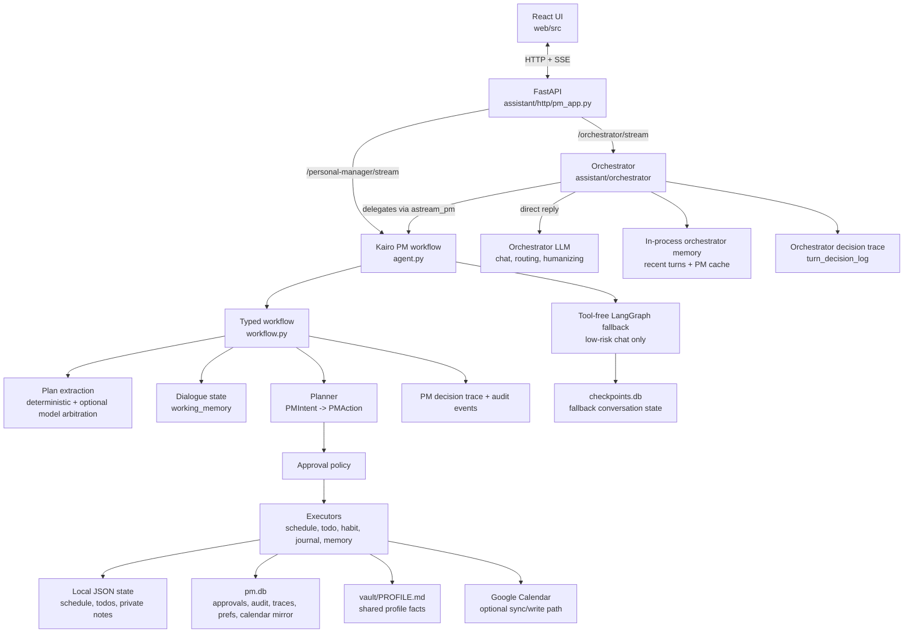
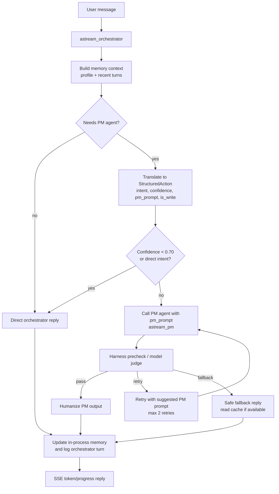
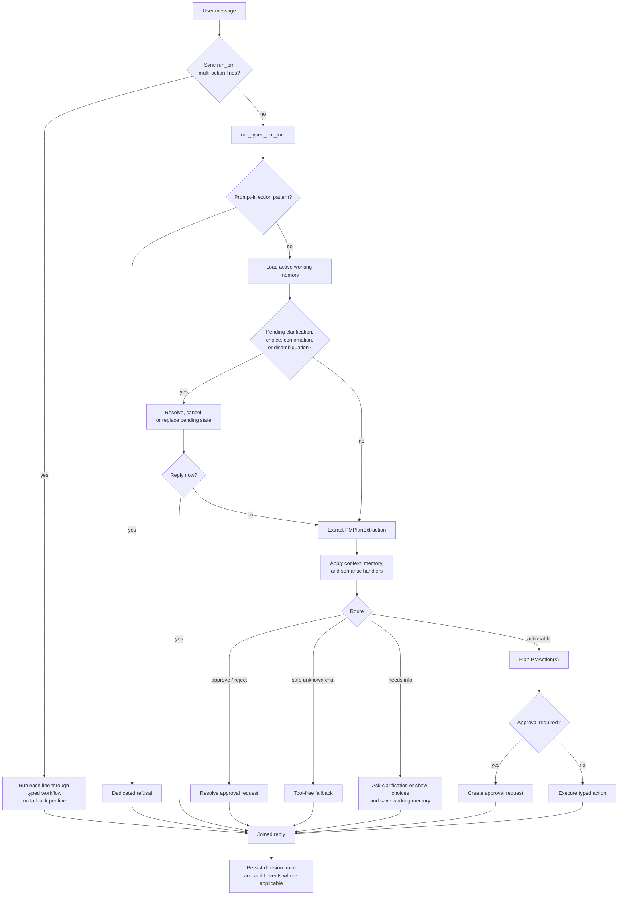
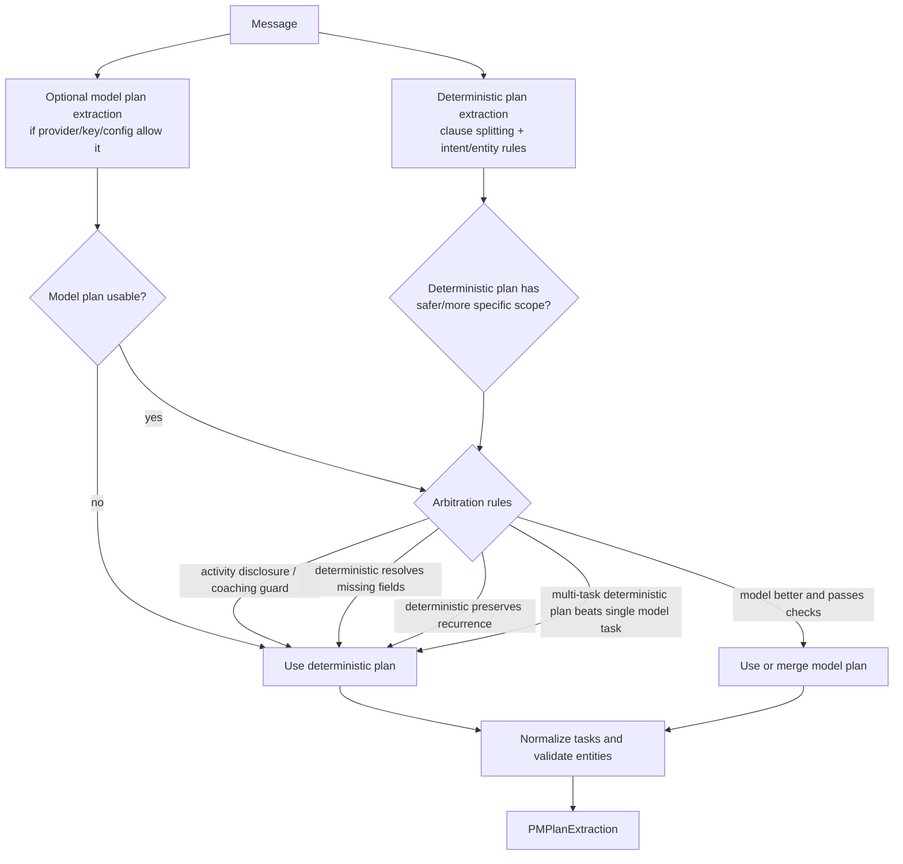
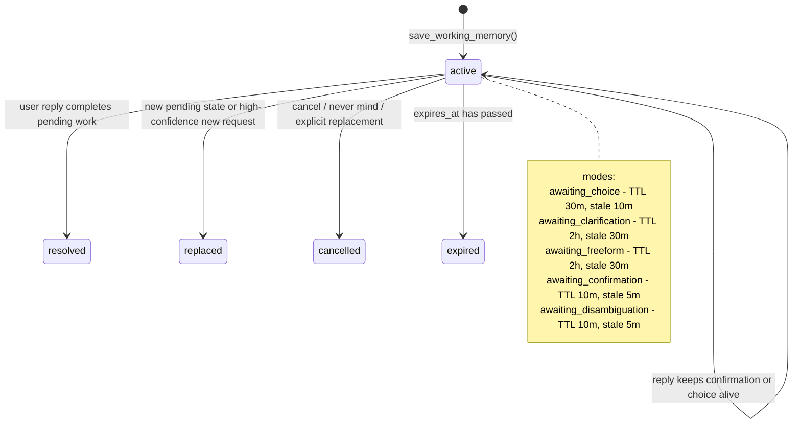
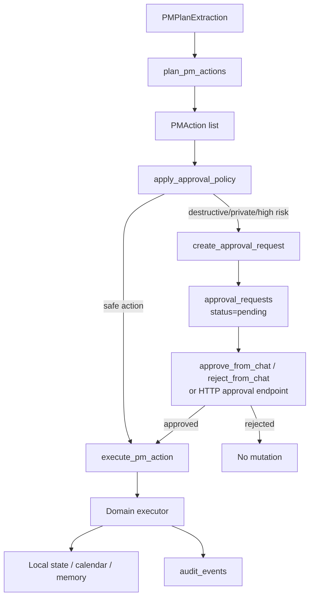
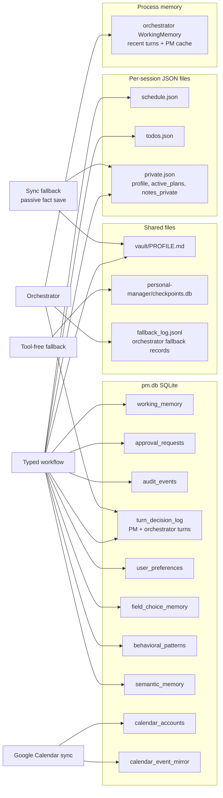
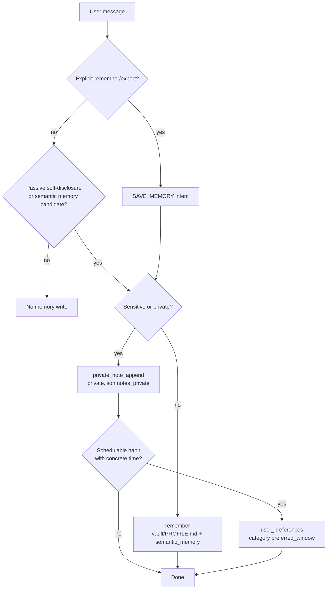

# Kairo + Orchestrator Architecture

This document describes the current Kairo orchestrator and controlled workflow
implementation. It is meant to be accurate enough for code review, not a
marketing diagram.

Primary source files:

- [`backend/assistant/orchestrator/agent.py`](backend/assistant/orchestrator/agent.py) - conversational router/translator/harness/humanizer over the PM agent
- [`backend/assistant/orchestrator/router.py`](backend/assistant/orchestrator/router.py) - heuristic plus model routing for direct vs delegated turns
- [`backend/assistant/orchestrator/translator.py`](backend/assistant/orchestrator/translator.py) - user request to structured PM trigger prompt
- [`backend/assistant/orchestrator/harness.py`](backend/assistant/orchestrator/harness.py) - PM result checking, retry, cache fallback, fallback logging
- [`backend/assistant/personal_manager/agent.py`](backend/assistant/personal_manager/agent.py) - sync/streaming entrypoints and tool-free fallback
- [`backend/assistant/personal_manager/workflow.py`](backend/assistant/personal_manager/workflow.py) - typed turn coordinator
- [`backend/assistant/personal_manager/application/extraction.py`](backend/assistant/personal_manager/application/extraction.py) - deterministic/model extraction arbitration
- [`backend/assistant/personal_manager/application/planner.py`](backend/assistant/personal_manager/application/planner.py) - intent-to-action planning
- [`backend/assistant/personal_manager/application/approval_policy.py`](backend/assistant/personal_manager/application/approval_policy.py) - destructive/privacy approval gates
- [`backend/assistant/personal_manager/persistence/`](backend/assistant/personal_manager/persistence) - working memory, approvals, audit, traces, personalization, semantic memory

## System Map

## Orchestrated Web Turn

The React app uses `/orchestrator/stream` for Kairo chat. The older
`/personal-manager/stream` endpoint still exists for direct Kairo PM streaming.

Important boundaries:

- The orchestrator can answer DIRECT for chat, support, or advice that does not
  require PM data.
- Delegated turns are translated into trigger-phrase-like PM prompts before
  reaching the typed PM workflow.
- Write turns invalidate the orchestrator PM cache.
- Harness fallback never fabricates write success; failed writes ask the user to
  retry or check the target data directly.
- Orchestrator memory is in-process and resets on backend restart. Durable PM
  state remains in Kairo's stores below.

## PM Turn Flow

Notes:

- `run_pm()` supports a newline-based multi-task splitter when every non-empty
  line starts with an action prefix.
- `astream_pm()` handles one message and streams only the fallback/model reply;
  the typed workflow still returns whole deterministic replies.
- Fallback is intentionally tool-free. State-changing requests should be handled
  by the typed workflow before fallback is allowed.

## Extraction Arbitration

Extraction does not have a simple "regex first, model second" order. The current
logic compares optional structured model output with deterministic extraction and
keeps the safer or more complete plan.

Single-request extraction follows the same idea: model extraction may run when
configured, but deterministic extraction can override missing, unsafe, or
less-specific model output. Entity validation happens before execution.

## Intent And Policy Boundaries

`classify_pm_intent()` is a deterministic priority ladder for common request
families:

- approval/rejection acknowledgements
- destructive schedule/todo operations
- explicit memory export/remember requests
- sensitive or non-sensitive web-search requests
- todos, journal, habits, list/read requests
- schedule create/update/skip/cancel-series operations
- coaching/general conversation
- bare `add X` todo fallback

Policy decisions are deliberately outside the extractor:

- The extractor identifies user intent and entities.
- The workflow decides whether a pending dialogue state exists.
- The planner converts `PMIntent` into one or more typed `PMAction` objects.
- The approval policy decides whether an action can execute immediately.
- Executors mutate only through typed actions, not raw user text.

## Working Memory

Working memory is short-lived structured dialogue state stored in SQLite. It is
used for clarification, ranked choices, contextual confirmations, and activity
disambiguation.

The workflow clears stale pending state when the next message looks like a new
request rather than a dialogue reply. This prevents unrelated turns from being
silently absorbed into an old clarification or confirmation.

## Planning, Approval, Execution

Approval-gated actions include todo deletion, schedule removal/update, recurring
schedule modifications, private exports/patches, and sensitive web-search
requests.

## Learning And Personalization

Ranked clarification choices are generated by
`application/field_completion.py`. Candidate ranking can use:

- explicit preferences in `user_preferences`
- promoted behavioral patterns in `behavioral_patterns`
- prior shown/selected choices in `field_choice_memory`
- semantic activity/default windows
- calendar conflict and repetition penalties

Repeated selections can be promoted:

- `promote_patterns_from_choice_memory()` creates a behavioral pattern after at
  least 4 selected samples, 3 distinct selection days, and 55% selection rate
  within the last 90 days.
- `promote_preference_from_repeat_selects()` creates a broader
  `time_band_engagement` preference after repeated selections in the same scope.
- `decay_behavioral_patterns()` reduces inactive pattern confidence by 10% per
  30-day period and archives patterns below 0.25 confidence.

Explicit sensitive habit statements can also write a category-scoped
`preferred_window` preference when they contain a schedulable activity and a
concrete time.

## Persistence

Runtime data lives under `data/` or `backend/data/` depending on how the app is
started. Those directories are gitignored and should not be published.

## Memory Routing

The memory policy is conservative: sensitive facts go to private PM storage,
lower-risk stable preferences can be shared through profile/semantic memory, and
fallback memory writes are confidence-gated.
