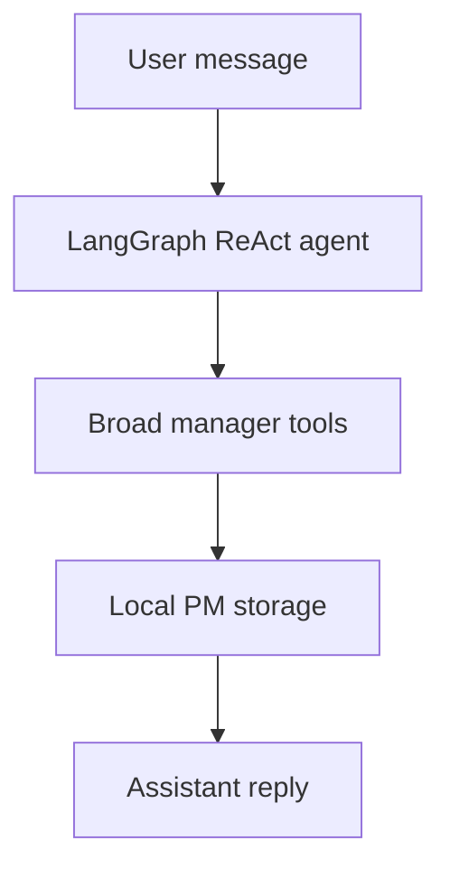
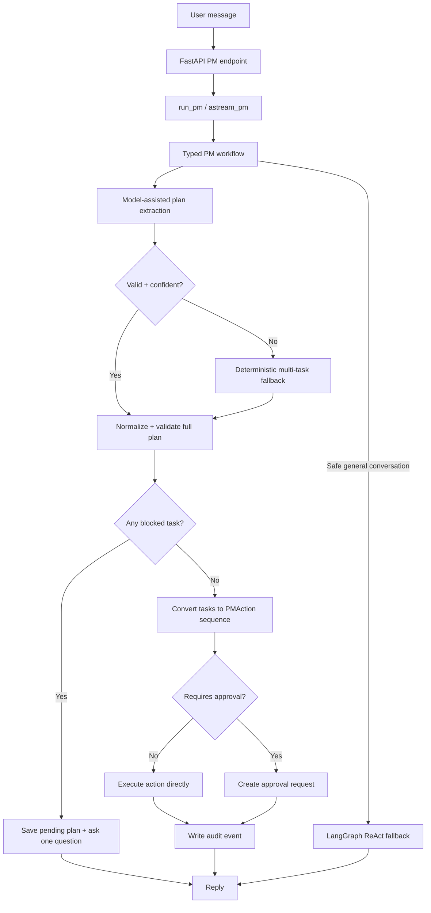
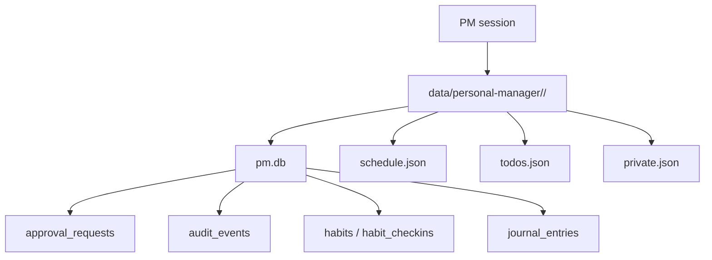
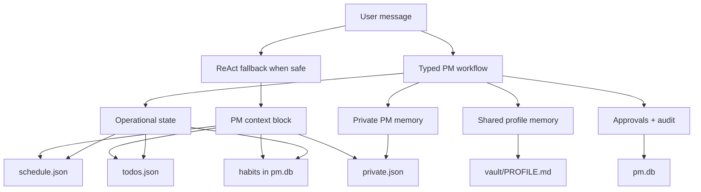
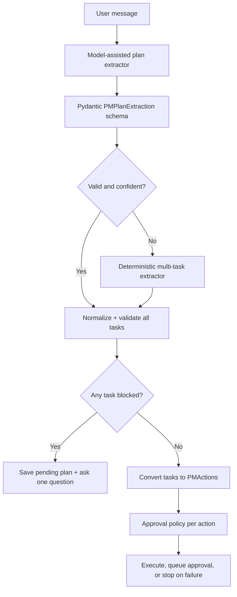
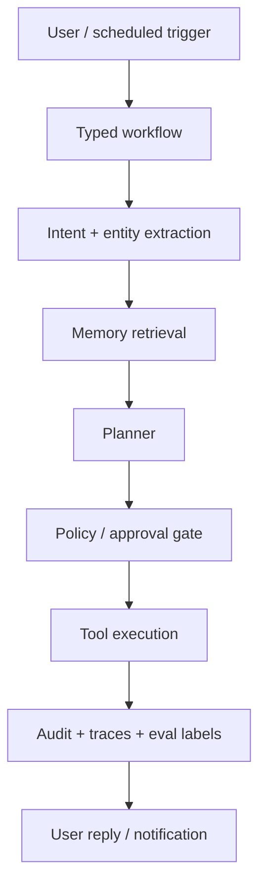

# Kairo Agent Versions

This file records Kairo's architecture versions so future changes have a clear history.

---

## v0 - Broad ReAct Agent

**Status:** previous architecture

**Shape:**



**Main behavior:**

- The model chose tools directly from the full Kairo tool list.
- Tools included schedule, todo, habit, journal, private memory, shared memory, notes, and web search.
- Session continuity came from LangGraph checkpointing.
- The same ReAct loop handled conversation, planning, and state-changing actions.

**Strengths:**

- Fast to build.
- Flexible.
- Easy to extend with more tools.
- Good for exploratory personal-assistant behavior.

**Weaknesses:**

- Too much control was left to the model.
- Risky actions could be attempted through broad tools.
- No durable approval queue.
- No first-class audit log.
- Harder to test intent, tool choice, and safety policy deterministically.

**Primary files:**

- `backend/assistant/personal_manager/agent.py`
- `backend/assistant/personal_manager/store.py`
- `backend/assistant/personal_manager/habits_db.py`
- `backend/assistant/personal_manager/journal_db.py`

---

## v1 - Pro-Core Typed Workflow

**Status:** current architecture

**Shape:**



**Main behavior:**

- State-changing requests go through code-controlled workflow stages.
- The typed workflow uses `PMIntent`, `PMExtraction`, `PMTaskExtraction`, `PMPlanExtraction`, `PMAction`, and `PMGraphState`.
- Entity extraction uses model-assisted strict JSON parsing when available, then falls back to deterministic regex.
- Model extraction is parse-only. It receives no tools and cannot execute actions, mutate state, search the web, or bypass approvals.
- The workflow plans the whole turn before executing anything. If any task in a multi-task plan is missing required information, it saves the pending plan, asks one targeted clarifying question, and executes nothing yet.
- Clarification answers update the blocked task, then the workflow revalidates the whole pending plan before running actions.
- Existing storage functions remain the execution backend.
- Risky actions create durable approval requests before execution.
- Mixed plans can queue approval-required actions and continue with later safe actions; hard execution failures stop later steps.
- Chat supports `approve <id>`, `reject <id>`, and single-pending `approve`.
- Audit events are recorded for classifications, actions, approvals, rejections, and failures.
- The LangGraph fallback is tool-free and remains only for safe general conversation.

**Approval rules:**

- No approval required:
  - add todo
  - complete todo
  - list/read state
  - add schedule event
  - habit check-in
  - add journal entry
  - save non-sensitive shared memory

- Approval required:
  - remove todo
  - update/remove/replace schedule event
  - remove habit
  - export private memory
  - all `private_*` writes, including sensitive PM-private notes
  - overwrite private profile fields
  - web search that may expose private context

**Storage:**



---

## v1 Upgrade Log, Reasons, And Tradeoffs

These upgrades moved Kairo from a flexible prototype toward an expert-designed personal assistant architecture. The main design goal is separation of power:

- model extracts language
- workflow validates and plans
- approval policy decides whether the action can run
- storage functions mutate state only after validation
- audit records what happened

| Priority | Update | What changed | Reason | Tradeoff |
|---|---|---|---|---|
| P0 | Privacy and access control | Kairo schedule, sessions, approvals, upcoming, journal/private-memory-related routes require bearer auth when `GATEWAY_TOKEN` is configured. Only `/health` stays public. Public PM routes use server-owned `DATA_DIR` / `VAULT_DIR` instead of caller-supplied storage overrides. | Kairo stores schedules, habits, journal entries, approvals, and private memory. Optional privacy boundaries are not acceptable for an expert-designed assistant. | Local ad hoc testing is less convenient because callers can no longer freely override data paths through public requests. Tests and local tooling must set environment-owned paths instead. |
| P1 | Transactionally safe approval execution | Approval execution now atomically claims `pending -> executing` before running an action. If the claim fails, the action is not executed. Approval lookup can be scoped by PM session. | Approval execution must be race-safe. "Execute once" should be enforced by storage, not by assuming requests are sequential. | The approval lifecycle is more complex: `pending`, `executing`, `executed`, `failed`, and `rejected` all need correct handling and user-facing messages. |
| P2.5 | Tool-free fallback | The LangGraph fallback receives no Kairo tools. It can only provide safe conversation/coaching. Stateful requests must be handled by the typed workflow or rejected with a clarifying response. | A fallback LLM should not improvise with schedule, journal, memory, search, or export tools. Sensitive actions need explicit validation and approval gates. | Some natural phrases feel less capable until the typed workflow understands them. This increases pressure to improve extraction coverage instead of relying on broad tool access. |
| P3 | Structured deterministic extraction | The workflow now extracts into a typed shape with intent, entities, confidence, missing fields, and source. Regex extraction supports phrases like `next Friday after lunch`, `move my dentist thing`, and `the second meeting tomorrow`. Low-confidence or incomplete mutations ask clarifying questions. | The workflow needed a measurable parser boundary before adding more intelligence. Structured extraction makes intent/entity behavior testable and auditable. | Deterministic rules still miss some messy human phrasing and require ongoing fixtures/tests as new phrase patterns appear. |
| P3.1 | Model-assisted extraction with deterministic fallback | When a real model is configured, the workflow asks it for strict JSON matching the `PMExtraction` schema. The model does not receive tools and cannot execute actions. Invalid, unavailable, or low-confidence model output falls back to deterministic regex. | This improves natural-language coverage without weakening safety. The LLM helps understand messy language, while the workflow still owns action planning, approval policy, and mutation. | Model extraction can add latency and may send the raw user request to the configured model provider. It also depends on provider availability, so the deterministic fallback remains required. |
| P3.2 | Mission-style schedule creation | Clear user missions with explicit date and time, such as `I NEED TO EAT BREAKFAST AT 8 AM TMR`, are now classified as schedule creation. The parser treats `tmr` / `tmrw` as tomorrow and cleans imperative titles into usable calendar labels. | The agent should not ask for fields that are already present. A clear title, date, and start time should produce the event directly. | The heuristic is intentionally limited to mission phrasing plus explicit date/time to avoid turning every `need to` sentence into a calendar event. Some borderline reminders may still route to tasks or clarification. |
| P3.3 | Multi-time schedule defaults | Calendar requests with several concrete slots, such as `Add next Friday 11 AM, tomorrow 8 AM, tomorrow 9 AM to my calendar`, now create multiple one-hour entries. If the user omits optional title, duration, notes, or location, the workflow uses `Scheduled block`, one hour, and empty notes. | Kairo should not force users to fill optional fields when the core action is clear. The agent should act with reasonable defaults and let the user edit later. | Generic titles are less descriptive than user-provided titles. The safer tradeoff is to create editable blocks instead of blocking automation with low-value questions. |
| P4 | Eval harness | Added `assistant.personal_manager.eval_runner`, which loads `pm_eval_cases.json`, scores extraction intent/entities/confidence, optionally runs seeded workflow cases, and reports pass/fail results through a CLI. | Parser and workflow quality need to be measurable before adding more intelligence or proactive behavior. The eval harness turns messy phrase support and approval boundaries into repeatable checks. | Fixtures require maintenance as behavior intentionally changes. Deterministic default mode may fail model-only phrases unless `--use-model` or a fake extractor is used. |
| P5 | Approval and audit visibility API | Added approval detail responses with non-executing previews, redacted sensitive approval payloads, and an audit endpoint for recent PM control events. | Approval systems need human visibility. The user should know what will change, why approval is required, and what already happened before approving high-impact actions. | Preview logic must stay aligned with execution logic. API surface area increases, and private previews need explicit redaction rules to avoid turning observability into a data leak. |
| P6 | Multi-task planning | Added a planner layer with `PMTaskExtraction` and `PMPlanExtraction`. One user prompt can become several tasks, the whole plan is validated before mutation, blocked plans ask one targeted question, and clear plans execute in order. Risky actions queue approvals while later safe actions continue; hard failures stop later steps. | Real personal-manager requests often contain multiple actions. The agent needs to extract potential tasks, plan them, and execute them one by one without letting unclear tasks cause partial accidental completion. | The all-or-nothing clarification rule can delay clear tasks when one task is unclear. This is intentional: it prevents hidden partial execution before the user resolves the plan. The planner also adds more state to pending clarification handling. |
| Docs | Agent-local documentation | Kairo's design history now lives under `backend/assistant/personal_manager/PERSONAL_MANAGER_AGENT_VERSIONS.md`; the root-level duplicate was removed. | Agent-specific architecture should live beside the agent code so future maintainers find it in the package they are changing. | The root project no longer has a top-level Kairo architecture file, so repo-level readers need to navigate into the agent package. |

### Safety Invariants After v1 Upgrades

- Public Kairo data routes must require auth when `GATEWAY_TOKEN` is set.
- Public requests must not choose arbitrary `data_dir` or `vault_dir` values.
- Approval execution must be storage-claimed before action execution.
- The fallback path must remain tool-free.
- The model-assisted extractor may parse only; it must not execute, mutate, search, export, or approve.
- Multi-task plans must be validated before any task mutates state.
- If any task in a plan is unclear, execute nothing until the user answers the targeted clarification.
- Pending clarification must store the pending plan, not only one loose intent.
- Missing fields or low confidence must produce a clarifying question before mutation.
- Risky actions must create approvals even when extraction confidence is high.
- Approval-required actions inside a clear mixed plan may queue approval requests while later safe actions continue.
- Hard execution failures must stop later plan steps and report where the failure happened.
- Approval previews must not execute actions.
- Private-memory and sensitive-search approval payloads must be redacted in API responses.
- Tests should cover unauthenticated access, approval races, fallback tool absence, extraction confidence, and messy natural phrases.

### Verification Added

- API contract tests for auth-gated PM reads and server-owned data roots.
- Concurrency tests proving overlapping approval calls execute the action once.
- Fallback tests proving no PM tools are passed to the LangGraph fallback.
- Extraction tests for natural phrases and low-confidence structured metadata.
- Regression test for mission-style schedule creation from `I NEED TO EAT BREAKFAST AT 8 AM TMR`.
- Regression test for multi-time schedule creation using default title, default one-hour duration, and empty notes.
- Planner tests for schedule + todo + journal in one prompt, all-or-nothing blocked plans, pending-plan clarification completion, approval-required steps mixed with later safe steps, hard-failure stop behavior, fake model multi-task plans, and deterministic multi-action fallback.
- Fake model-extractor tests with no API calls for schedule moves, vague deletion, reminders, journal logs, and shared memory.
- Eval fixture fields for expected intent, entities, confidence band, action type, approval requirement, and mutation class.
- Eval-runner support for `schedule_created` workflow mutations.
- Eval runner tests proving fixture loading, extraction scoring, bad-entity failures, approval-without-mutation scoring, and fake model-extractor scoring.
- API tests proving approval detail previews, audit event listing, auth gating, and private payload redaction.

---

## Memory Handling In v1

Kairo uses several memory layers. They are separated because some memory is operational, some is private, some is shared across assistant modes, and some is control metadata.



### Memory Types

| Memory type | Stored in | Used for | Privacy level |
|---|---|---|---|
| Conversation/checkpoint memory | `data/personal-manager/checkpoints.db` | LangGraph fallback conversation continuity | PM session only |
| Schedule memory | `schedule.json` | Calendar-like local blocks | PM session only |
| Todo memory | `todos.json` | Local task list | PM session only |
| Habit memory | `pm.db` tables `habits`, `habit_checkins` | Habit tracking and streaks | PM session only |
| Journal memory | `pm.db` table `journal_entries` | Private reflections and dated journal entries | PM-private |
| Private manager memory | `private.json` | Sensitive preferences, routines, active plans, private notes | PM-private |
| Shared profile memory | `vault/PROFILE.md` | Non-sensitive facts/preferences visible to other assistant modes | Shared |
| Approval memory | `pm.db` table `approval_requests` | Pending/rejected/executed risky actions | PM control state |
| Audit memory | `pm.db` table `audit_events` | Trace of classifications, actions, approvals, failures | PM control state |

### How The Typed Workflow Uses Memory

The typed workflow does not rely on the model to remember state-changing instructions. It uses memory through direct code paths:

1. It builds a small context snapshot from schedule and todos.
2. It extracts the request into a `PMPlanExtraction` containing one or more `PMTaskExtraction` objects.
3. It normalizes entities, applies defaults, and validates every task before mutation.
4. It asks one clarifying question and stores the pending plan if any task is blocked.
5. It converts clear tasks into ordered `PMAction` execution units.
6. It applies the approval policy to each action.
7. It executes direct storage functions, creates approval requests, or stops on hard failure.
8. It records audit events.

This makes state-changing behavior more predictable than the old ReAct-only approach.

## Extraction Pipeline In v1

Kairo now separates language understanding from authority.



The single-task extraction schema remains:

```json
{
  "intent": "CREATE_TODO",
  "entities": {},
  "confidence": 0.0,
  "missing_fields": [],
  "reasoning_summary": "",
  "source": "model_structured"
}
```

The plan extraction schema is:

```json
{
  "tasks": [
    {
      "task_id": "task-1",
      "intent": "CREATE_SCHEDULE_EVENT",
      "entities": {},
      "confidence": 0.0,
      "missing_fields": [],
      "depends_on": [],
      "source": "model_structured",
      "reasoning_summary": ""
    }
  ],
  "global_missing_fields": [],
  "confidence": 0.0,
  "source": "model_structured"
}
```

Rules:

- The model may only parse the message into the schema.
- The model is not given schedule, todo, journal, private-memory, web-search, or approval tools.
- Invalid JSON, schema validation failure, unavailable model calls, and low-confidence model output fall back to deterministic regex.
- Missing required fields produce a clarifying question before any action execution.
- If one task in a multi-task plan is unclear, no tasks execute until clarification updates the pending plan.
- Schedule creation requires only date and start time; title defaults to `Scheduled block`, duration defaults to one hour, and notes/location default to empty.
- Risky actions still go through the approval queue even when the model parsed the request correctly.
- The workflow records extraction source and confidence in audit metadata.

Examples now covered by tests:

- `push my dentist thing to after lunch next Friday`
- `move the second meeting tomorrow`
- `delete the thing with Alex`
- `remind me about passport renewal after work`
- `log that I felt anxious today`
- `remember I prefer short morning workouts`
- `Tomorrow 8am breakfast, remind me to call John, and log that I felt anxious`

### Private Memory

Private memory is stored in `private.json`.

Current private metadata shape:

```json
{
  "profile": {},
  "active_plans": [],
  "notes_private": []
}
```

Private memory is used for sensitive or manager-only information:

- medical, financial, legal, or relationship details
- private goals, fears, routines, and constraints
- sensitive user preferences
- manager-only notes that should not be shared with the default assistant

Current behavior:

- Sensitive `remember` requests are routed to PM-private memory.
- In v1, sensitive facts are appended to `notes_private` only after approval.
- `notes_private` is capped to the latest 50 entries.
- Private memory export and all `private_*` writes require approval before execution.
- The audit log should summarize private operations, not dump full private metadata.

### Shared Profile Memory

Shared memory is stored in `vault/PROFILE.md`.

It is used only for non-sensitive facts or preferences that are safe for other assistant modes to see.

Examples:

- preferred answer style
- favorite programming language
- non-sensitive product preferences
- formatting preferences

Rules:

- Do not store sensitive personal details in `PROFILE.md`.
- If uncertain, use PM-private memory instead.
- If `VAULT_DIR` is not configured, shared memory writes return `Memory not configured`.

### Operational Memory

Operational memory is the agent's working state for managing life/logistics.

It includes:

- `schedule.json` for local schedule blocks
- `todos.json` for tasks
- `pm.db` habit tables for habit definitions and check-ins
- `pm.db` journal table for private entries

The typed workflow reads and writes these stores directly. The model does not freely mutate them for controlled actions.

### Conversation Memory

Conversation memory still exists through LangGraph checkpointing.

It is mainly used by the tool-free fallback path:

- general coaching
- safe planning conversation
- supportive conversation
- summaries and non-mutating help

The fallback context block includes:

- current date/time
- schedule
- todos
- habits
- private metadata

State-changing requests should be caught by the typed workflow before they reach this fallback path.

### Approval And Audit Memory

Approvals and audits are not user memory in the personal-profile sense. They are control memory.

Approval records store:

- approval id
- session id
- action type
- action payload
- risk level
- status
- created/decided timestamps
- stored execution result

Audit records store:

- classified turns
- executed actions
- failed actions
- approval creation
- approval execution
- approval rejection

Approvals are idempotent. If an approval was already executed, approving it again returns the stored result instead of running the action twice.

### Approval Detail And Audit API

The backend exposes approval visibility without executing the approval:

- `GET /personal-manager/approvals` lists approvals for a PM session.
- `GET /personal-manager/approvals/{approval_id}` returns one approval plus a preview.
- `POST /personal-manager/approvals/{approval_id}/approve` atomically claims and executes a pending approval.
- `POST /personal-manager/approvals/{approval_id}/reject` atomically rejects a pending approval.
- `GET /personal-manager/audit` returns recent audit events for a PM session.

Preview behavior:

- `schedule_update` previews before/after schedule fields and field-level changes.
- `schedule_remove` previews which entries would be removed.
- `todo_remove` previews which task items would be removed.
- `private_*` previews are redacted and describe only the category of private-memory change.
- `web_search_blocked` previews are redacted and do not expose sensitive search text.

Approval detail is an observability surface, not an execution path. It must never mutate state.

### Web Search Privacy

Web search is treated as an external boundary.

Rules:

- Raw private memory should not be used as a search query.
- Sensitive web-search requests create an approval-blocked action instead of searching immediately.
- Queries should be generalized before any future search integration uses private context.

### Current Memory Limitations

- No semantic vector memory yet.
- No memory review UI yet.
- No automatic consolidation from `notes_private` into structured profile fields yet.
- No expiration policy for stale memories yet.
- No Postgres/Supabase memory backend yet.
- No long-running eval dashboard yet; the local eval runner and fixture cover extraction/workflow regressions.

---

## v2 - Product-Grade Manager Workflow

**Status:** planned next version

**Shape:**



**Target additions:**

- Daily planning workflow with structured plan output.
- Memory candidate review before saving important long-term facts.
- Proactive morning briefing, evening review, and overdue-task checks.
- Frontend approval queue UI.
- Trace scoring, larger fixture coverage, and longitudinal model-quality tracking.
- Optional migration from local JSON/SQLite storage to Postgres when needed.

**Do not include yet:**

- Autonomous external email sending.
- Payments or purchases.
- Full calendar provider integration without explicit approval rules.
- Replacing FastAPI/Python agent runtime with a Next.js backend.

---

## Version Summary

| Version | Architecture | Main Upgrade | Risk Control |
|---|---|---|---|
| v0 | Broad ReAct agent | Flexible tool use | Prompt-based |
| v1 | Typed workflow + tool-free fallback | Model-assisted extraction + multi-task planner + deterministic state-changing actions | Approval queue + audit log |
| v2 | Product-grade manager workflow | Proactive planning, memory review, richer evals | Policy gate + UI review + traces |
